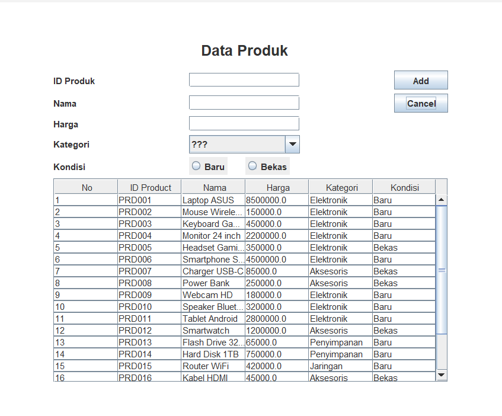
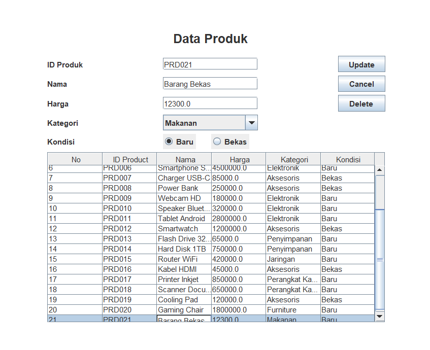

# TP5DPBO2425C1

# Janji
Saya Daffa Dhiyaa Candra dengan NIM 2404286 mengerjakan 
TP 5 dalam mata kuliah Desain dan Pemrograman
Berorientasi Objek untuk keberkahanNya maka saya tidak 
melakukan kecurangan seperti yang telah dispesifikasikan. Aamiin.

---

# Desain Program
Program saya terdiri dari  

**Class `Product`**
Dengan Atribut :  
    - ID  
    - Nama  
    - Harga  
    - Kategori  
    - Kondisi  

dan Method  :  
    - Getter dan Setter untuk semua atribut

dan sudah terhubung dengan database **db_product1**

**Class `ProductMenu`**
Dengan Atribut :  
    - listProduct  
    - Component  

dan Method :  
    - insertData()  
    - updateData()  
    - deleteData()  
    - clearForm()  
    - setTable()  

Untuk komponen yang dipakai adalah :  
    - JTextField untuk ID  
    - JTextField untuk nama  
    - JTextField untuk harga  
    - JComboBox untuk Kategori  
    - JRadioButton untuk kondisi  
    - JRadioButton untuk Add  
    - JRadioButton untuk Cancel  
    - JRadioButton untuk Delete  

---

# Penjelasan Alur

1. Saat Product Menu dijalankan, program akan membuat koneksi ke MySQL (db_product1), mengambil seluruh data dari tabel produk, dan menampilkannya ke dalam Tabel.  
2. Menambahkan Produk. User menggunakan form ID, Nama, Harga, Kategori, dan Kondisi. Jika ada input yang kosong, maka akan muncul pesan error "Semua kolom harus diisi!". Jika menginput ID yang sama, maka akan muncul pesan error "ID sudah digunakan!". Jika valid, data akan dimasukkan ke database.  
3. Saat user meng-klik salah satu baris di tabel, form input akan diisi data dari indek yang dipilih, tombol "Add" diubah menjadi tombol "Update", tombol "Delete" ditampilkan.  
4. Setelah meng-klik baris di tabel dan mengubah data di form, tekan tombol "Update", program akan mengubah data melalui query **SET** ke database.   
5. Setelah meng-klik baris di tabel dan menekan tombol "Delete", akan muncuk konfirmasi "Apakah kamu yakin ingin menghapus data ini?". Jika memilih "iya" data akan dihapus, jika memilih tidak akan kembali ke form update.  
6. Jika meng-klik tombol "Cancel", program akan mengosongkan semua input di form dan menyembunyikan tombol "Delete".  

---

# Dokumentasi

## Menu  
  

## Insert  
  
  
  
  

## Update
  
  
  

## Delete  
  
  
